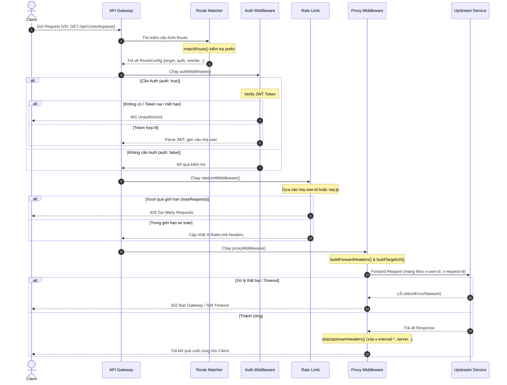

# API Gateway

Single entry point for the Kanban microservices stack. This service applies cross-cutting concerns (CORS, request IDs, auth, rate limiting, proxying, logging) and forwards requests to upstream services.

## Overview

Request Diagram:



Health check is available at `GET /health` and bypasses auth/rate limits.

## Project Structure

```
root/api-gateway/
  config/
    env.ts
    routes.ts
  lib/
    logger.ts
    rate-limiter.ts
  middleware/
    auth.middleware.ts
    cors.middleware.ts
    proxy.middleware.ts
    rate-limit.middleware.ts
    request-id.middleware.ts
  types/
    index.ts
  utils/
    response.ts
  index.ts
  server.ts
  .example.env
```

## Requirements

- Node.js 18+ (for built-in `fetch` and `AbortSignal.timeout`)
- `pnpm` or `npm` (workspace uses `pnpm`)

## Setup

1. Copy environment variables:

```bash
cp .example.env .env
```

2. Fill in required values in `.env`:

- `JWT_SECRET`
- `AUTH_SERVICE_URL`
- `WORKSPACE_SERVICE_URL`
- `BOARD_SERVICE_URL`
- `NOTI_SERVICE_URL`
- `STATISTIC_SERVICE_URL`

3. Install dependencies:

```bash
pnpm install
```

## Run

Development (auto-reload):

```bash
pnpm dev
```

Production:

```bash
pnpm start
```

## Configuration

All configuration is loaded from environment variables in `config/env.ts`.

| Variable | Required | Default | Notes |
| --- | --- | --- | --- |
| `GATEWAY_PORT` | No | `8080` | HTTP port for the gateway |
| `NODE_ENV` | No | `development` | Controls CORS behavior |
| `JWT_SECRET` | Yes | - | Must match the token issuer secret |
| `AUTH_SERVICE_URL` | Yes | - | Upstream base URL for auth endpoints |
| `WORKSPACE_SERVICE_URL` | Yes | - | Upstream base URL |
| `BOARD_SERVICE_URL` | Yes | - | Upstream base URL |
| `NOTI_SERVICE_URL` | Yes | - | Upstream base URL |
| `STATISTIC_SERVICE_URL` | Yes | - | Upstream base URL |
| `RATE_LIMIT_WINDOW_MS` | No | `60000` | Sliding window size |
| `RATE_LIMIT_MAX_REQUESTS` | No | `100` | Global max requests per window |
| `CORS_ORIGINS` | No | empty | Comma-separated list of allowed origins |
| `UPSTREAM_TIMEOUT_MS` | No | `10000` | Upstream timeout per request |

See `.example.env` for the full template.

## Routes

Routes are matched by prefix in order (first match wins) in `config/routes.ts`.

| Prefix | Target | Auth | Rewrite |
| --- | --- | --- | --- |
| `/api/v1/auth/login` | `AUTH_SERVICE_URL` | No | `/api/v1/auth/*` → `/*` |
| `/api/v1/auth/register` | `AUTH_SERVICE_URL` | No | `/api/v1/auth/*` → `/*` |
| `/api/v1/workspaces` | `WORKSPACE_SERVICE_URL` | Yes | `/api/v1/*` → `/*` |
| `/api/v1/boards` | `BOARD_SERVICE_URL` | Yes | `/api/v1/*` → `/*` |
| `/api/v1/notifications` | `NOTI_SERVICE_URL` | Yes | `/api/v1/*` → `/v1/*` |
| `/api/v1/statistics` | `STATISTIC_SERVICE_URL` | Yes | `/api/v1/statistics/*` → `/api/v1/statistics/*` |

Notes:
- The auth service is gRPC in the main architecture; this gateway currently forwards auth HTTP endpoints to `AUTH_SERVICE_URL`.
- Methods can be restricted per-route in `config/routes.ts`.

## Auth

- `Authorization: Bearer <token>` is required for protected routes.
- JWT is validated with `JWT_SECRET`.
- The gateway extracts `id` (or `sub`), `email`, and `role` into `req.user`.

## Rate Limiting

- Sliding window in-memory limiter (`lib/rate-limiter.ts`).
- Keyed by `userId` when authenticated, otherwise by IP.
- Per-route overrides exist for workspaces, boards, and statistics.

Response headers (always set):

- `X-RateLimit-Limit`
- `X-RateLimit-Remaining`
- `X-RateLimit-Reset` (Unix seconds)

On limit exceeded, the gateway returns `429` and sets `Retry-After`.

## Request Transformation

Spoofable headers removed before forwarding:

- `x-user-id`
- `x-user-email`
- `x-user-role`
- `x-request-id`

Trusted headers injected:

- `x-request-id`
- `x-user-id` (if authenticated)
- `x-user-email` (if authenticated)
- `x-user-role` (if authenticated)
- `x-forwarded-for`
- `x-forwarded-proto`
- `x-gateway-version: 1.0`

## Response Transformation

Headers stripped from upstream responses:

- `x-powered-by`
- `server`
- Any header starting with `x-internal-`

## Error Format

All gateway-generated errors follow:

```json
{
  "error": "token_expired",
  "message": "Token has expired",
  "requestId": "<uuid>"
}
```

Common status codes:

- `401` missing/invalid token
- `404` no route matched
- `429` rate limit exceeded
- `502` upstream unavailable
- `504` upstream timeout

## CORS

- Allowed origins: `CORS_ORIGINS` (comma-separated)
- In development, `*` allows all origins
- Methods: `GET, POST, PUT, PATCH, DELETE, OPTIONS`
- Credentials are enabled

## Logging

Structured JSON logs to stdout via `lib/logger.ts`.

Request log entry fields:

- `requestId`, `method`, `path`, `routePrefix`, `clientId`, `statusCode`, `durationMs`, `userAgent`

## Health Check

```http
GET /health
```

Returns:

```json
{
  "status": "ok",
  "service": "api-gateway",
  "timestamp": "<iso>"
}
```

## Local Verification

Quick checks:

```bash
curl -i http://localhost:8080/health
curl -i http://localhost:8080/api/v1/workspaces
```

## Limitations

- In-memory rate limiting (not suitable for multi-instance deployments)
- No WebSocket proxying
- No circuit breaker or caching

## Future Enhancements

The following are planned but not implemented:

- Redis-based distributed rate limiting
- Circuit breaker for upstreams
- Response caching for read-heavy routes
- Prometheus metrics
- mTLS for service-to-service requests

