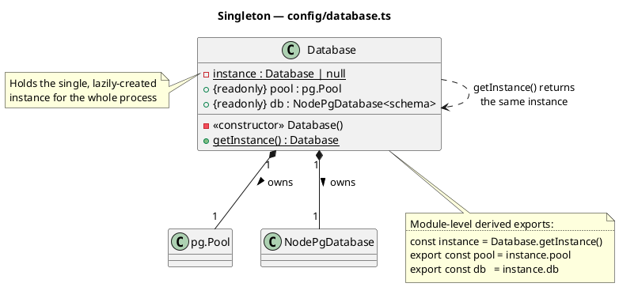
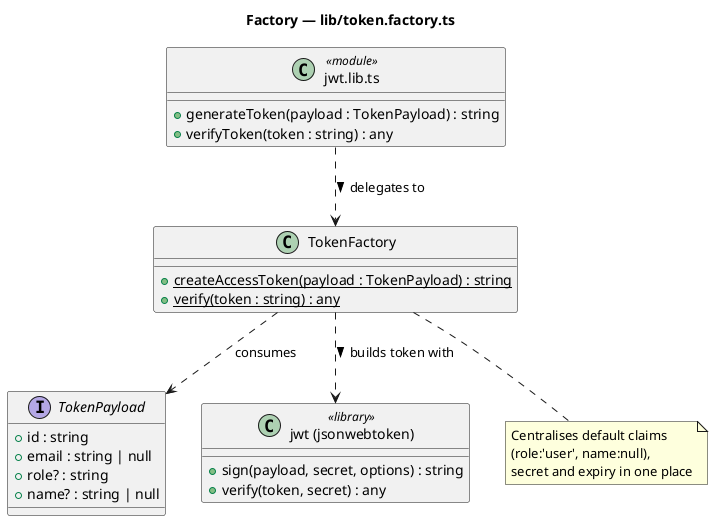
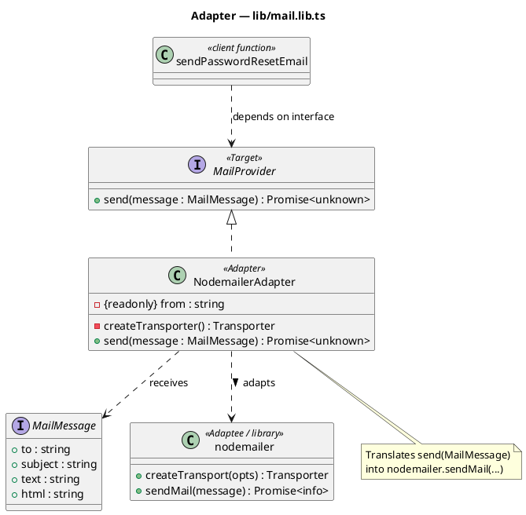
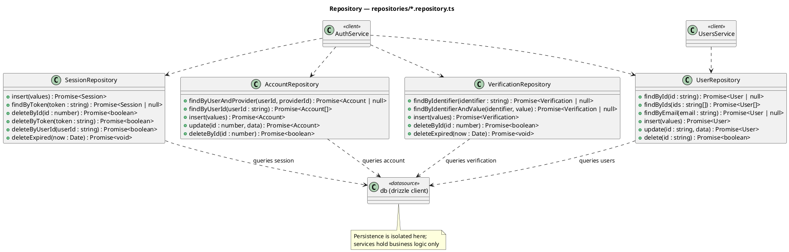
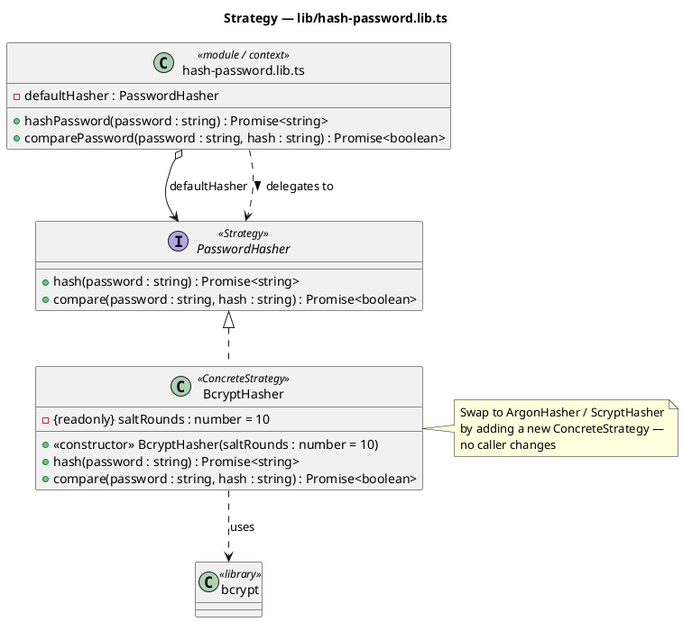

# Design Patterns — auth-service

A minimal, behavior-preserving migration introduced **5 GoF design patterns** spanning
all three categories (creational, structural, behavioral). No public function changed
its signature or behavior — every previous export still works, so controllers, routes,
and other services were not modified.

| # | Pattern | Category | Location |
|---|---------|----------|----------|
| 1 | Singleton | Creational | `config/database.ts` |
| 2 | Factory | Creational | `lib/token.factory.ts` |
| 3 | Adapter | Structural | `lib/mail.lib.ts` |
| 4 | Repository | Structural | `repositories/*.repository.ts` |
| 5 | Strategy | Behavioral | `lib/hash-password.lib.ts` |

---

## 1. Singleton — `config/database.ts`

**What:** A `Database` class owns the Postgres `Pool` and the drizzle client.
`Database.getInstance()` builds the connection lazily and returns the same instance
on every call. The familiar `db` and `pool` exports are derived from that instance.

**Why:**
- A database connection pool is a heavyweight, shared resource — there must be exactly
  one per process. Singleton guarantees this and prevents accidental pool duplication.
- Centralises the "is `AUTH_URL` set?" guard and pool configuration in one owner.
- Keeps the public `db` / `pool` exports identical, so nothing downstream changed.

## 2. Factory — `lib/token.factory.ts`

**What:** `TokenFactory.createAccessToken(payload)` centralises construction of signed
JWTs — secret, expiry, and default claims (`role: 'user'`, `name: null`) live in one
place. `lib/jwt.lib.ts`'s `generateToken` / `verifyToken` now delegate to the factory.

**Why:**
- Token creation has non-trivial construction logic (default claims, sign options) that
  callers should not repeat or know about. A factory hides that behind one call.
- Single source of truth for how an access token is built — change the claims or expiry
  once instead of hunting through call sites.
- `generateToken` keeps its old signature, so controllers are untouched.

## 3. Adapter — `lib/mail.lib.ts`

**What:** A `MailProvider` interface defines `send(message)`. `NodemailerAdapter`
adapts the third-party nodemailer transport to that interface. `sendPasswordResetEmail`
talks to the interface, never to nodemailer directly.

**Why:**
- Decouples the application from a specific email vendor. Swapping nodemailer for SendGrid,
  SES, or a fake in tests means writing a new adapter — no caller changes.
- Wraps an external library behind an interface we control, the textbook use of Adapter.
- `sendPasswordResetEmail` behaves exactly as before (same subject, body, error handling).

## 4. Repository — `repositories/*.repository.ts`

**What:** `UserRepository`, `SessionRepository`, `AccountRepository`, and
`VerificationRepository` encapsulate all drizzle queries for their table. Services
(`AuthService`, `UsersService`) now call repository methods instead of building
`db.select()/insert()/update()/delete()` queries inline.

**Why:**
- Separates **persistence** (how rows are fetched/stored) from **business logic**
  (validation, hashing, expiry checks, token issuing) that stays in the services.
- One place to change a query, add an index hint, or later swap the ORM.
- Makes services easier to read and to unit-test against a fake repository.
- Pure refactor — the SQL/drizzle operations are identical to before.

## 5. Strategy — `lib/hash-password.lib.ts`

**What:** A `PasswordHasher` interface declares `hash` / `compare`. `BcryptHasher` is the
concrete strategy (bcrypt, 10 salt rounds). `hashPassword` / `comparePassword` delegate
to a default `BcryptHasher` instance.

**Why:**
- The hashing algorithm is an interchangeable policy. Strategy lets us swap bcrypt for
  argon2 or scrypt (e.g. for a security upgrade) by adding a class, with no caller edits.
- Salt-round / cost configuration is encapsulated in the strategy object.
- The exported helpers keep their old signatures, so services are unaffected.

---

## Behavior-preservation summary

- Every previously exported symbol (`db`, `pool`, `generateToken`, `verifyToken`,
  `hashPassword`, `comparePassword`, `sendPasswordResetEmail`, `AuthService`,
  `UsersService`) still exists with the same signature.
- Controllers, routes, schema, and server bootstrap were **not** modified.
- `tsc --noEmit` reports no new errors for `auth-service`.

---

## UML diagrams (PlantUML)

### 1. Singleton — `config/database.ts`

### 2. Factory — `lib/token.factory.ts`

### 3. Adapter — `lib/mail.lib.ts`

### 4. Repository — `repositories/*.repository.ts`

### 5. Strategy — `lib/hash-password.lib.ts`

