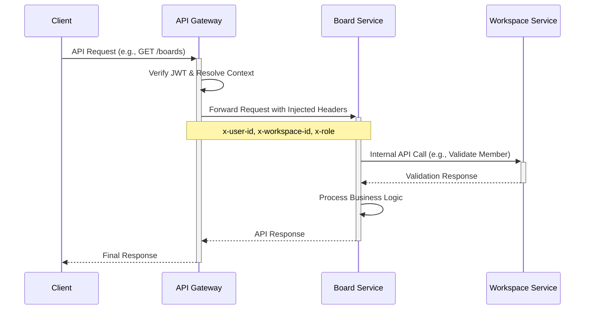

# Board Service API Specification

## 1. Overview

This document provides a detailed technical specification for the RESTful APIs of the **Board Service** in the Kanban system. The Board Service handles the core domain entities related to agile task management: boards, lists, cards, labels, and their relationships. It relies on the Workspace Service for handling the broader workspace context, user roles, and permissions.

## 2. Architecture Flow

The request lifecycle for the Board Service is as follows:



## 3. Authentication & Context

Authentication is handled exclusively by the **API Gateway**. The Board Service does not verify JWTs directly.

The API Gateway is responsible for:
1. Verifying the incoming JWT from the client.
2. Resolving the user and workspace context.
3. Injecting context headers into the request before forwarding it to the Board Service.

### Context Headers

| Header | Description | Example |
|---|---|---|
| `x-user-id` | The unique UUID of the authenticated user. | `550e8400-e29b-41d4-a716-446655440000` |
| `x-workspace-id` | The numeric ID of the current workspace. | `123` |
| `x-role` | The role of the user within the workspace. | `member` |

## 4. Base URL

All endpoints are resource-based and prefix from the base URL:
```
/api/v1
```

*(Note: The routing may be handled directly by the Gateway, but at the service level, endpoints are purely resource-based like `/boards`, `/lists/:listId`, etc.)*

## 5. Common Headers

| Header | Required | Description |
|---|---|---|
| `Content-Type` | Yes | `application/json` for requests with body. |
| `x-user-id` | Yes | The user ID performing the action. |
| `x-workspace-id` | Yes | The context workspace ID. |
| `x-role` | Optional | The workspace role (if required for validation). |

## 6. Common Response Format

All successful API responses follow a standardized JSON structure.

**Success Response:**
```json
{
  "success": true,
  "data": { ... },
  "message": "Success message"
}
```

**Listing Response (Collection):**
```json
{
  "success": true,
  "data": [
    { ... }
  ],
  "message": "Success"
}
```

## 7. Error Codes

Errors return a standardized response with a `success: false` flag.

| HTTP Status | Error Code | Description |
|---|---|---|
| 400 | `BAD_REQUEST` | Validation failed or malformed request. |
| 401 | `UNAUTHORIZED` | Missing headers (usually blocked by gateway). |
| 403 | `FORBIDDEN` | Insufficient permissions to perform action. |
| 404 | `NOT_FOUND` | `BOARD_NOT_FOUND`, `LIST_NOT_FOUND`, `CARD_NOT_FOUND`, etc. |
| 409 | `CONFLICT` | Resource conflict (e.g. duplicate member assignment). |
| 422 | `VALIDATION_ERROR` | Business logic validation failure. |
| 500 | `INTERNAL_SERVER_ERROR` | Unexpected server-side failure. |

**Error Response Example:**
```json
{
  "success": false,
  "error": {
    "code": "CARD_NOT_FOUND",
    "message": "Card with the given ID was not found."
  }
}
```

## 8. Ordering Strategy

The order of **Lists** dynamically placed within a board and **Cards** within a list is determined by the `index` field.
* `index` is an integer.
* When adding a new List or Card, it defaults to the highest `index` + 1 (placed at the end).
* Reordering is achieved by a dedicated endpoint receiving an array of updated object IDs mapping to their new sequence. The Service updates indices natively utilizing transactions to guarantee consistency.

## 9. Board APIs

### `GET /boards`
* **Description:** Retrieve all active boards in the workspace.
* **Headers:** `x-user-id`, `x-workspace-id`
* **Query Params:** none
* **Validation Rules:** Workspace must be valid. User must belong to workspace.
* **Business Rules:** Return boards belonging to `x-workspace-id` where `deletedAt` is null.
* **Internal Calls:** `GET /internal/workspaces/:workspaceId/members/:memberId`
* **Response Example:**
  ```json
  {
    "success": true,
    "data": [
      {
        "publicId": "brd_123456",
        "name": "Sprint 1",
        "description": "Tasks for sprint 1",
        "type": "regular",
        "visibility": "private"
      }
    ],
    "message": "Success"
  }
  ```

### `POST /boards`
* **Description:** Create a new board.
* **Headers:** `x-user-id`, `x-workspace-id`
* **Request Body:**
  ```json
  {
    "name": "Sprint 2",
    "description": "Board for Sprint 2",
    "type": "regular",
    "visibility": "public"
  }
  ```
* **Validation Rules:** `name` is required.
* **Business Rules:** `workspaceId` sourced from headers. `createdBy` set to `x-user-id`. Creates a `slug` based on `name`.
* **Response Example:** Returns the created Board object.

### `GET /boards/:boardId`
* **Description:** Get specific board metadata.
* **Headers:** `x-user-id`, `x-workspace-id`
* **Path Params:** `boardId` (publicId)
* **Business Rules:** Board under `workspaceId`, `deletedAt` is null.
* **Error Responses:** 404 `BOARD_NOT_FOUND`.

### `PATCH /boards/:boardId`
* **Description:** Update a board details.
* **Headers:** `x-user-id`, `x-workspace-id`
* **Path Params:** `boardId` (publicId)
* **Request Body:** `{ "name": "New Name", "description": "New Desc" }`
* **Business Rules:** Only update permitted fields. Cannot change workspace.

### `DELETE /boards/:boardId`
* **Description:** Soft-delete a board.
* **Headers:** `x-user-id`, `x-workspace-id`
* **Path Params:** `boardId` (publicId)
* **Transaction Notes:** Wrap in transaction.
* **Business Rules:** Cascade soft-delete down to all linked Lists and Cards. Populate `deletedAt` and `deletedBy`.

### `GET /boards/:boardId/detail`
* **Description:** Retrieve board alongside nested Lists and Cards.
* **Headers:** `x-user-id`, `x-workspace-id`
* **Path Params:** `boardId` (publicId)
* **Business Rules:** Join lists and cards omitting any soft-deleted entity. Grouped by their hierarchy, ordered by `index`.

## 10. List APIs

### `GET /boards/:boardId/lists`
* **Description:** Retrieve all lists of a specified board.
* **Headers:** `x-user-id`, `x-workspace-id`
* **Path Params:** `boardId` (publicId)
* **Business Rules:** Must validate board exists and belongs to the workspace.

### `POST /boards/:boardId/lists`
* **Description:** Add a new list to a board.
* **Headers:** `x-user-id`, `x-workspace-id`
* **Path Params:** `boardId`
* **Request Body:** `{ "name": "In Progress" }`
* **Business Rules:** Set `index` as MAX(current indices) + 1. `createdBy` is `x-user-id`.

### `PATCH /lists/:listId`
* **Description:** Update list name.
* **Headers:** `x-user-id`, `x-workspace-id`
* **Path Params:** `listId` (publicId)
* **Request Body:** `{ "name": "Done" }`

### `DELETE /lists/:listId`
* **Description:** Soft delete a list.
* **Headers:** `x-user-id`, `x-workspace-id`
* **Path Params:** `listId` (publicId)
* **Transaction Notes:** Wrap in transaction.
* **Business Rules:** Cascade soft-delete cards matching this list. Set `deletedAt`, `deletedBy`.

### `PATCH /boards/:boardId/lists/reorder`
* **Description:** Modify list ordering within a board.
* **Headers:** `x-user-id`, `x-workspace-id`
* **Path Params:** `boardId` (publicId)
* **Request Body:** `{ "listIds": ["lst_002", "lst_001", "lst_003"] }`
* **Transaction Notes:** Wrap in transaction to avoid partial index updates.
* **Business Rules:** IDs mapped arrays reassign the `index` property matching their array placement. Must validate same board ownership.

## 11. Card APIs

### `GET /lists/:listId/cards`
* **Description:** Retrieve cards under a list.
* **Headers:** `x-user-id`, `x-workspace-id`
* **Path Params:** `listId`
* **Business Rules:** Filter out deleted cards. Sorted by `index` ascending.

### `POST /lists/:listId/cards`
* **Description:** Create a new card.
* **Headers:** `x-user-id`, `x-workspace-id`
* **Path Params:** `listId`
* **Request Body:** `{ "title": "Buy milk", "description": "Go to store" }`
* **Business Rules:** Place at max `index` + 1. Create `card_activity` entry (`card.created`).

### `GET /cards/:cardId`
* **Description:** Get card metadata.
* **Path Params:** `cardId`

### `PATCH /cards/:cardId`
* **Description:** Update card details.
* **Request Body:** `{ "title": "New Title", "description": "New Desc" }`
* **Business Rules:** Log activity `card.updated.title` if title changes, `card.updated.description` if description changes.

### `DELETE /cards/:cardId`
* **Description:** Soft-delete a card.
* **Path Params:** `cardId`
* **Business Rules:** Set `deletedAt`, `deletedBy`. Log `card.archived`.

### `PATCH /cards/:cardId/move`
* **Description:** Move a card to a different list.
* **Headers:** `x-user-id`, `x-workspace-id`
* **Path Params:** `cardId`
* **Request Body:** `{ "targetListId": "lst_xxx", "newIndex": 2 }`
* **Transaction Notes:** Re-index destination cards locally, move item over. Wrap in tx.
* **Business Rules:** Validate same board. Log `card.updated.list`.

### `PATCH /lists/:listId/cards/reorder`
* **Description:** Order cards inside the *same* list.
* **Path Params:** `listId`
* **Request Body:** `{ "cardIds": ["crd_002", "crd_001"] }`
* **Transaction Notes:** Transaction required.

## 12. Label APIs

### `GET /boards/:boardId/labels`
* **Description:** Get all labels defined for a board.
* **Path Params:** `boardId`

### `POST /boards/:boardId/labels`
* **Description:** Create a new label on the board.
* **Request Body:** `{ "name": "Bug", "colourCode": "#FF0000" }`

### `POST /cards/:cardId/labels`
* **Description:** Attach label to card.
* **Request Body:** `{ "labelId": "lbl_xxx" }`
* **Business Rules:** Insert `_card_labels`. Log `card.updated.label.added`. Validates label belongs to identical board as card.

### `DELETE /cards/:cardId/labels/:labelId`
* **Description:** Detach label.
* **Business Rules:** Delete `_card_labels`. Log `card.updated.label.removed`.

## 13. Card Member APIs

### `GET /boards/:boardId/members`
* **Description:** Get members having access context available for assignment on this board.
* **Internal Calls:** Proxy to `GET /internal/workspaces/:workspaceId/members`

### `POST /cards/:cardId/members`
* **Description:** Assign a workspace member to a card.
* **Headers:** `x-user-id`, `x-workspace-id`
* **Request Body:** `{ "workspaceMemberId": "mem_123" }`
* **Business Rules:** Validation: Ensure member not previously assigned, valid workspace member. Insert `_card_workspace_members`. Log `card.updated.member.added`.

### `DELETE /cards/:cardId/members/:memberId`
* **Description:** Unassign member.
* **Path Params:** `cardId`, `memberId`
* **Business Rules:** Delete `_card_workspace_members`. Log `card.updated.member.removed`.

## 14. Due Date APIs

### `PATCH /cards/:cardId/due-date`
* **Description:** Adjust/set due date.
* **Request Body:** `{ "dueDate": "2026-05-20T10:00:00Z" }`
* **Business Rules:** Log `card.updated.dueDate.added` OR `card.updated.dueDate.updated`. Update `dueDate` on card.

### `DELETE /cards/:cardId/due-date`
* **Description:** Cancel due date.
* **Business Rules:** Set `dueDate` to NULL. Log `card.updated.dueDate.removed`.

## 15. Internal Workspace Service APIs

The Board Service acts as a client calling the Workspace Service natively.

* `GET /internal/workspaces/:workspaceId`
  - Purpose: Confirm existence of Workspace.
* `GET /internal/workspaces/:workspaceId/members/:memberId`
  - Purpose: Validate `x-user-id` resolving an operation effectively belongs to `workspaceId`.
* `GET /internal/workspaces/:workspaceId/members`
  - Purpose: Pull members array mapping context for card delegation.
* `POST /internal/workspaces/:workspaceId/permissions/check`
  - Purpose: Execute deep role or permission verification prior to strict manipulations.

## 16. Transaction Requirements

State mutating chains **must employ transactions** utilizing Drizzle to avoid corrupted domains:
* **Move Card (`PATCH /cards/:cardId/move`)**: Both source sequence re-calibration, destination sequence mapping, and relationship updates must hit atomically.
* **Reorder Cards / Lists**: Reassigning multiples integers iterating the DOM array must execute enclosed.
* **Delete Board**: Modifying the base table `deletedAt`, triggering correlated queries executing cascading soft-deletes spanning lists + cards within an enclosed lock.
* **Delete List**: Standardizing `deletedAt` down its hierarchical components (Cards).

## 17. Activity Logging Rules

Crucial for an audit trail mapping the entity lifecycle, activities populate `card_activities` representing defined event snapshots.

Action executions demanding logging include:
* Creating a Card -> `card.created`
* Title updates -> `card.updated.title`
* Description modifications -> `card.updated.description`
* Cross-list placement -> `card.updated.list`
* Label management -> `card.updated.label.added` / `card.updated.label.removed`
* Member allocation -> `card.updated.member.added` / `card.updated.member.removed`
* Archiving/Soft-Deleting Card -> `card.archived`
* Due dates adjustments -> `card.updated.dueDate.added` | `.updated` | `.removed`

*Implementation Details:* `fromTitle`, `toTitle`, `fromListId`, `toListId` mapping old and new properties respectively should accompany logging records when available. Ensure `createdBy` logs action origins.

## 18. Soft Delete Rules

A strict archival paradigm is required replacing destructive deletions.

* **Enforcement:** Under no circumstance is a `DELETE` database sequence activated.
* **Implementation:** `deletedAt` (current timestamp) & `deletedBy` (originating `x-user-id`).
* **Cascade Isolation:**
    1. Board soft-deletion requires List and Card soft-deletion matching the Board context.
    2. List soft-deletion cascades matching nested Cards soft-deletions.
* **Query Scoping:** Any `GET` fetch / lookup must statically filter `where: isNull(table.deletedAt)`.

## 19. Business Validation Rules

Robust logical integrity constraints applied globally across operations:

* **Workspace Validation:** Any lookup / execution enforcing ownership to target resource mapping its ultimate parent Board -> mapped to `workspaceId` headers accurately.
* **Duplicate Member Validation:** Blocking primary key duplications verifying member wasn't assigned identically against `_card_workspace_members` via controller validation.
* **Same Board Validation:** When transitioning nested components (such as Card movement, Label allocation, List transitions), enforce cross-referenced IDs evaluating parent correlation is uniform.
* **Ordering Scope Boundaries:** Arrays provided resolving sequence alignments ensure items belong uniformly exclusively resolving against their shared parent identity bridging transaction locks avoiding unaligned assignments.
