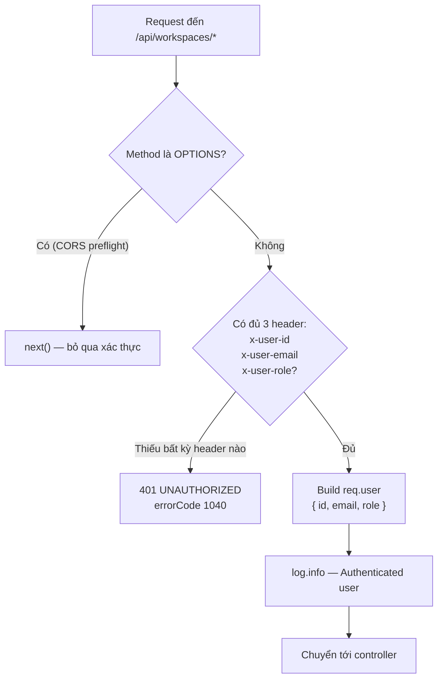

# Auth Middleware Flowchart — Workspace Service

> Lưu đồ xử lý của `middleware/auth.ts` — cổng vào duy nhất cho mọi route `/api/workspaces/*`.

## Lưu đồ

## Bảng tham chiếu

| Bước | Source | Ghi chú |
|---|---|---|
| Kiểm tra method OPTIONS | `middleware/auth.ts:21` | Cho qua preflight CORS, không cần header định danh |
| Đọc header `x-user-*` | `middleware/auth.ts:24-26` | Header do gateway gắn sau khi xác thực JWT |
| Trả 401 nếu thiếu | `middleware/auth.ts:28-30` | Code `ERROR_CODES.UNAUTHORIZED = 1040` |
| Build `req.user` | `middleware/auth.ts:32-36` | `req.user` được augment tại `types/` (Express namespace) |
| Log | `middleware/auth.ts:38` | Sử dụng common logger |

## Lưu ý kiến trúc

- Workspace-service **không tự verify JWT** — trách nhiệm xác thực thuộc về API Gateway.
- Mọi route trong `/api/workspaces/*` mặc định đi qua middleware này.
- Route `/internal/*` **không** áp dụng middleware → cần network-level protection (gateway/service mesh) để không expose ra Internet.
