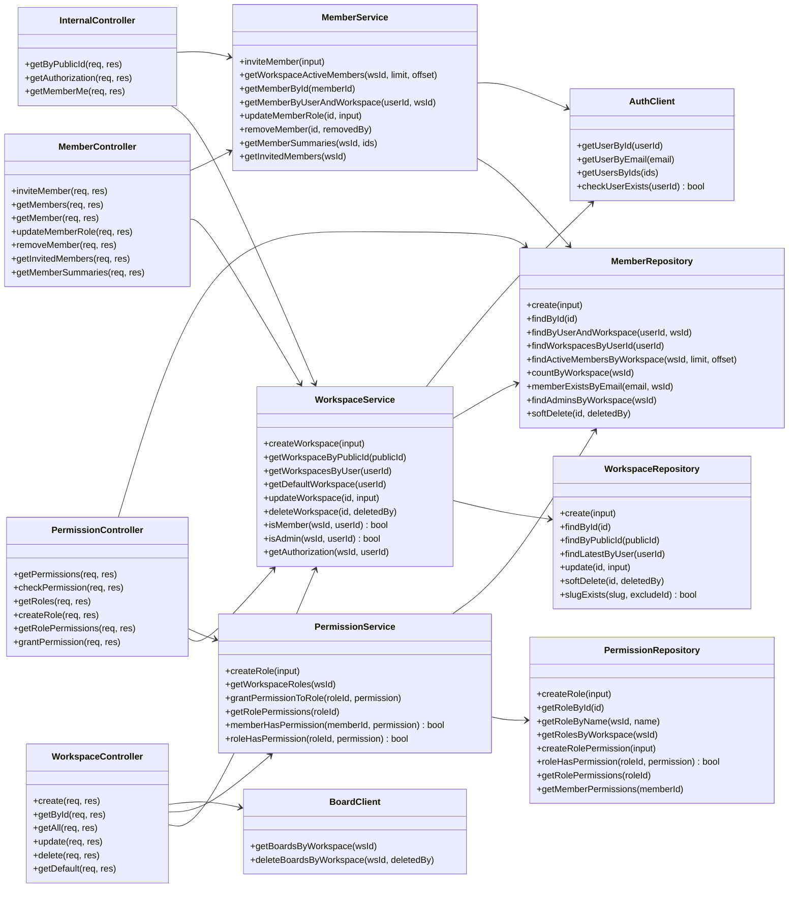

# Class Diagram — Workspace Service

> Kiến trúc 3 tầng **Controller → Service → Repository** + tầng external client.
> Nguồn: `api/controllers/`, `services/`, `repositories/`, `infrastructure/clients/`.

## Tổng quan

Mỗi module tổ chức theo pattern:

- **Controller** — nhận HTTP request, validate input, gọi service.
- **Service** — chứa business logic, dùng repository và client ngoài.
- **Repository** — bọc DB (Drizzle ORM).
- **Client** — bọc HTTP call sang service khác (auth, board, noti).

## Class diagram

## Ghi chú

- Service và Repository được export dưới dạng **singleton instance** (vd. `workspaceService`, `workspaceRepository`) cho phép import trực tiếp, đơn giản hoá dependency injection.
- Client (`authClient`, `boardClient`, `notificationClient`) kế thừa `BaseClient` (axios-based) trong `infrastructure/clients/base.client.ts`.
- Tầng repository implement interface DAO (xem `repositories/dao/`) — thuận tiện cho việc mock trong unit test.
