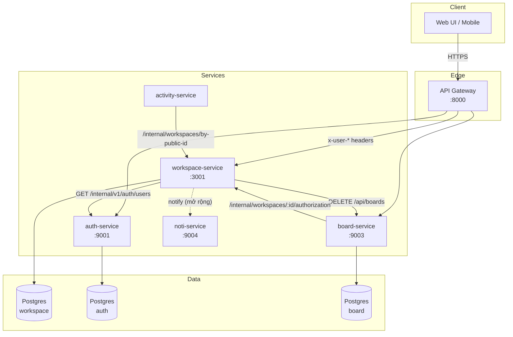

# Component / Deployment Diagram — Workspace Service

> Vị trí của `workspace-service` trong hệ microservice và các thành phần phụ thuộc.

## Sơ đồ

## Các luồng truyền thông chính

| Hướng | Endpoint dùng | Mục đích |
|---|---|---|
| WS → AUTH | `GET /internal/v1/auth/users/:id` | Lấy email người tạo workspace |
| WS → AUTH | `GET /internal/v1/auth/users?email=` | Xác minh email khi mời thành viên |
| WS → BOARD | `DELETE /api/boards?workspaceId=` | Cascade xoá board khi xoá workspace (best-effort) |
| BOARD → WS | `GET /internal/workspaces/:id/members/:userId/authorization` | Kiểm tra user có phải admin/owner workspace không |
| ACT → WS | `GET /internal/workspaces/by-public-id/:publicId` | Resolve publicId → id nội bộ |

## Cấu hình URL service (env)

| Biến | Default | Service nào |
|---|---|---|
| `AUTH_SERVICE_URL` | `http://localhost:9001` | auth-service |
| `BOARD_SERVICE_URL` | `http://localhost:9003` | board-service |
| `NOTIFICATION_SERVICE_URL` | `http://localhost:9004` | noti-service |
| `GATEWAY_URL` | `http://localhost:8000` | gateway |

## Lưu ý kiến trúc

- Các route `/internal/*` của workspace-service **không** có middleware xác thực — gateway/service mesh phải bảo vệ ở mức network để không expose ra ngoài.
- Tất cả request từ public Internet phải đi qua API Gateway; gateway gắn 3 header `x-user-id`, `x-user-email`, `x-user-role` rồi forward đến workspace-service.
- Workspace-service không gọi trực tiếp activity-service. Activity-service tự pull workspace info qua `/internal`.
