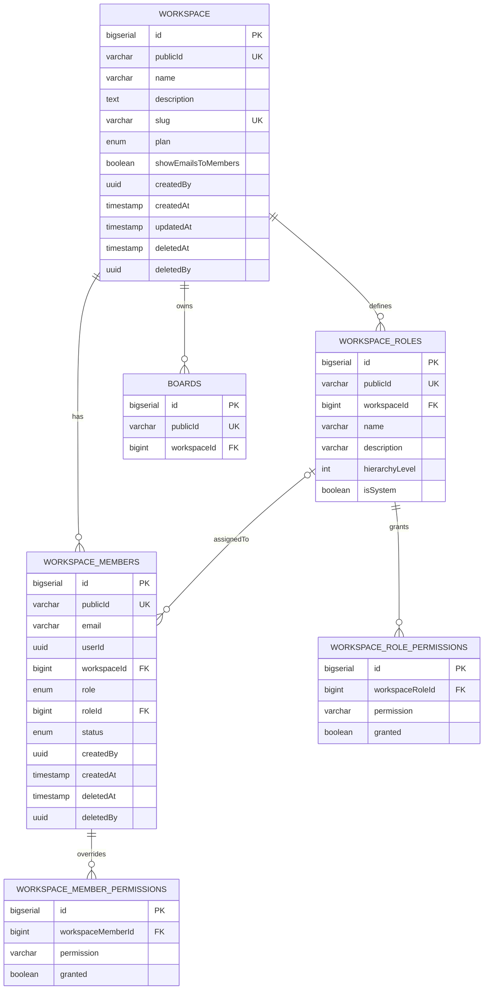

# Entity Relationship Diagram — Workspace Service

> Trực quan hoá schema PostgreSQL (Drizzle ORM, RLS bật).
> Nguồn: `schema/workspaces.ts`, `schema/members.ts`, `schema/permissions.ts`, `schema/boards.ts`.

## Quan hệ tổng quan

- 1 **workspace** có nhiều **members**, nhiều **roles**, nhiều **boards**.
- 1 **role** có nhiều **role permissions**; 1 **member** có thể có nhiều **member-level permission overrides**.
- 1 **member** có thể được gán 1 **role** (tuỳ chọn, qua `roleId`).

## Biểu đồ

### Diễn giải cột (vì ERD không hiển thị tốt diacritic):

- `WORKSPACE.publicId` — chuỗi 12 ký tự (nanoid), UNIQUE toàn hệ thống.
- `WORKSPACE.plan` — enum `free` / `pro` / `enterprise`, default `free`.
- `WORKSPACE_MEMBERS.userId` — UUID, soft link sang `auth-service` (không FK cứng).
- `WORKSPACE_MEMBERS.role` — enum `admin` / `member`.
- `WORKSPACE_MEMBERS.roleId` — FK sang `workspace_roles.id`, nullable.
- `WORKSPACE_MEMBERS.status` — enum `active` / `removed` / `paused` (default DB là `invited`).
- `WORKSPACE_ROLES.name` — UNIQUE per workspace (UNIQUE(`workspaceId`, `name`)).
- `permission` — chuỗi thuộc `PERMISSION_TYPES`.

## Ghi chú

- Các trường `createdBy`, `deletedBy`, `userId` là **soft link** sang `auth-service` (không có FK cứng).
- Tất cả bảng đều bật **RLS** (Row-Level Security) qua `.enableRLS()`.
- Khoá ngoài `workspaceId` → `workspace.id` đều dùng `ON DELETE CASCADE` (xoá workspace cứng sẽ xoá theo members, roles, boards), tuy nhiên flow hiện tại chỉ dùng **soft delete**.
- `workspace_members.roleId` dùng `ON DELETE RESTRICT` để không vô tình xoá role khi còn người gán.
- UNIQUE constraints quan trọng:
  - `workspace.slug` (toàn hệ thống).
  - `workspace.publicId`, `workspace_members.publicId`, `workspace_roles.publicId`.
  - `(workspaceId, name)` trên `workspace_roles`.
  - `(workspaceRoleId, permission)` trên `workspace_role_permissions`.
  - `(workspaceMemberId, permission)` trên `workspace_member_permissions`.
