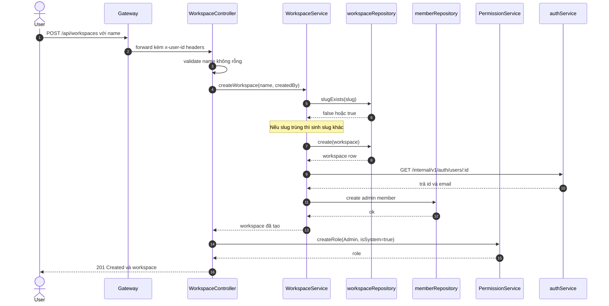
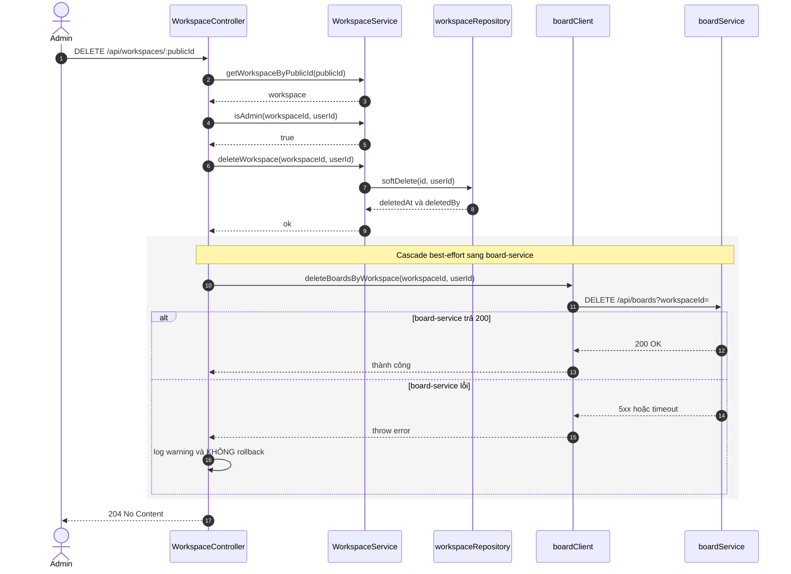
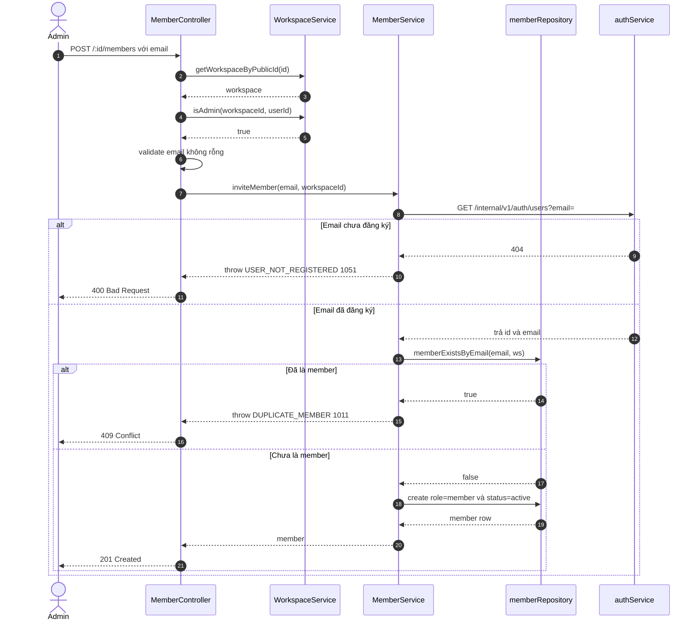
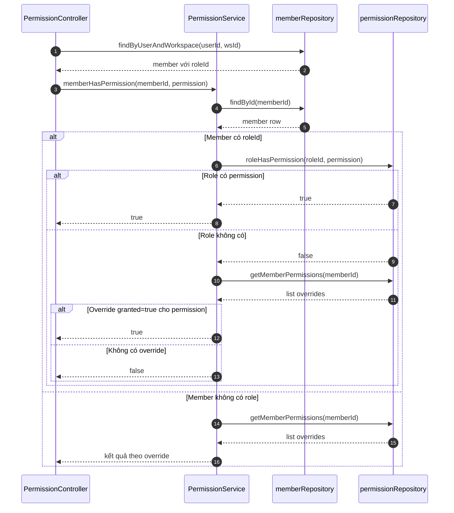

# Sequence Diagrams — Workspace Service

> Trình tự gọi giữa các tầng (Controller → Service → Repository → external client)
> cho các luồng nghiệp vụ quan trọng. Trích từ code thật trong `services/`, `api/controllers/`.

Mục lục:
1. [Tạo workspace](#1-tạo-workspace)
2. [Xoá workspace (best-effort cascade)](#2-xoá-workspace-best-effort-cascade)
3. [Mời thành viên](#3-mời-thành-viên)
4. [Kiểm tra permission](#4-kiểm-tra-permission)

---

## 1. Tạo workspace

`POST /api/workspaces`

**Các bước chính:**
1. Gateway gắn header `x-user-*` vào request.
2. Controller validate `name`.
3. Service sinh `publicId`, kiểm tra/sinh `slug` duy nhất.
4. Tạo bản ghi workspace.
5. Gọi `auth-service` lấy email người tạo.
6. Tạo member admin tương ứng.
7. Tạo role hệ thống "Admin".

---

## 2. Xoá workspace best-effort cascade

`DELETE /api/workspaces/:id`

**Điểm quan trọng:** Bước cascade sang board-service là **best-effort** — nếu lỗi chỉ log warning, vẫn trả 204 cho client. Workspace đã được soft-delete trước đó.

---

## 3. Mời thành viên

`POST /api/workspaces/:id/members`

---

## 4. Kiểm tra permission

Áp dụng cho:
- `GET /api/workspaces/:id/permissions?permission=<name>`
- `POST /api/workspaces/:id/permissions` (body: `{ permission }`)

Logic: **role-permission trước, fallback xuống member-permission override**.

