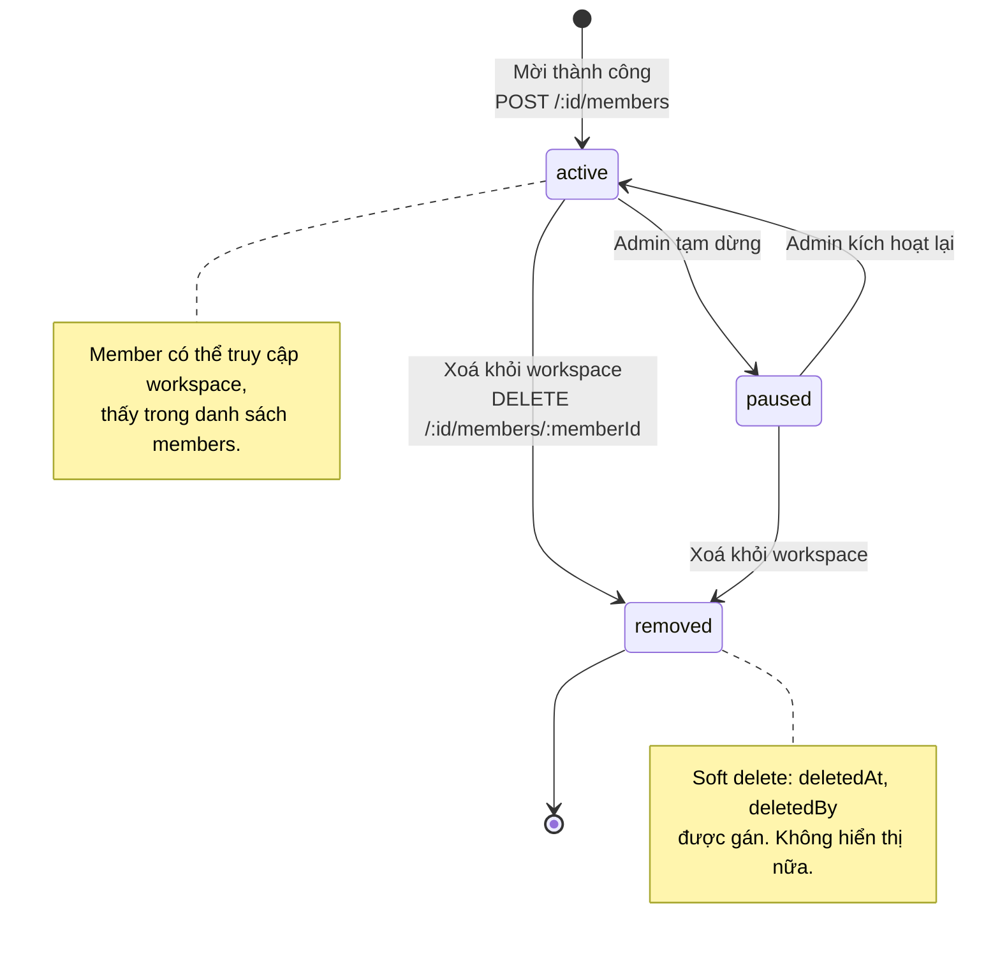
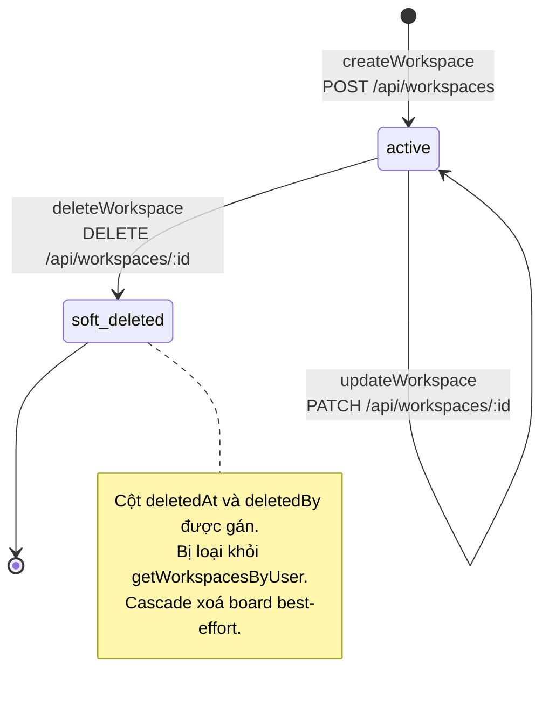
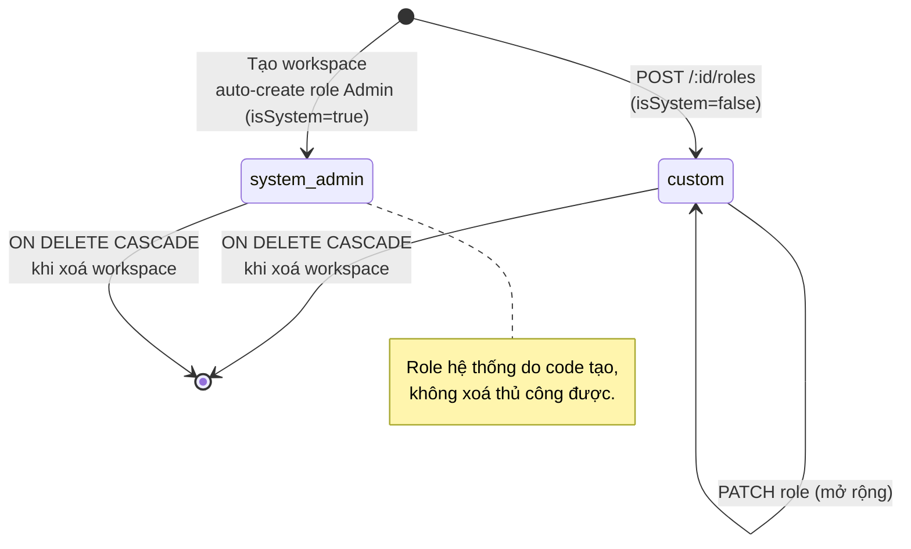

# State Diagrams — Workspace Service

> Vòng đời các thực thể chính, biểu diễn bằng `stateDiagram-v2` của Mermaid.

## 1. Vòng đời `workspace_members.status`

Schema có 3 trạng thái: `active`, `paused`, `removed` (xem `config/constants.ts → MEMBER_STATUS`).
Trong code hiện tại, member được tạo thẳng với `status = active` khi admin mời (`member.service.inviteMember`).

> Lưu ý: schema còn định nghĩa giá trị mặc định DB là `invited`, nhưng các flow hiện tại đều tạo thẳng `active`. Nếu mở rộng flow "invite → user accept" thì cần thêm state `invited` trước `active`.

---

## 2. Vòng đời `workspace`

---

## 3. Vòng đời `workspace_roles`

Role được tạo thuộc 1 workspace (`isSystem = true` cho role "Admin" mặc định, `false` cho role tuỳ chỉnh).

