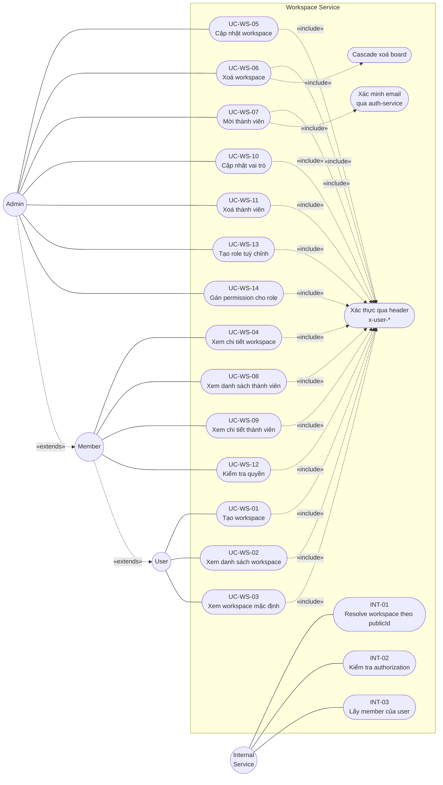

# Use Case Diagram Tổng Quát — Workspace Service (UML 2.0)

> Biểu đồ ca sử dụng **tổng quát** cho toàn bộ workspace-service: workspace, thành viên, quyền, role, và route nội bộ.
> Tham chiếu use case workspace-only tại `docs/use-case-diagram.md`.

## 1. Phạm vi (System Boundary)

Hệ thống được mô hình hoá: `Workspace Service`. Bao gồm 14 use case public (UC-WS-01..14) và 3 use case nội bộ (INT-01..03).

## 2. Tác nhân (Actors)

| Actor | Loại | Mô tả |
|---|---|---|
| **User** | primary | Người dùng đã đăng nhập (có `x-user-*` headers do gateway gắn) |
| **Member** | primary | User là thành viên active của workspace |
| **Admin** | primary | Member có `role = admin` |
| **Internal Service** | secondary | board-service, activity-service gọi qua `/internal/*` |

Quan hệ generalization: `Admin → Member → User`.

## 3. Biểu đồ tổng quát

## 4. Phân nhóm use case

### Nhóm A — Workspace (UC-WS-01..06)

| Mã | Tên | Tác nhân chính | Endpoint |
|---|---|---|---|
| UC-WS-01 | Tạo workspace | User | `POST /api/workspaces` |
| UC-WS-02 | Xem danh sách workspace | User | `GET /api/workspaces` |
| UC-WS-03 | Xem workspace mặc định | User | `GET /api/workspaces/default` |
| UC-WS-04 | Xem chi tiết workspace | Member | `GET /api/workspaces/:id` |
| UC-WS-05 | Cập nhật workspace | Admin | `PATCH /api/workspaces/:id` |
| UC-WS-06 | Xoá workspace | Admin | `DELETE /api/workspaces/:id` |

### Nhóm B — Member (UC-WS-07..11)

| Mã | Tên | Tác nhân chính | Endpoint |
|---|---|---|---|
| UC-WS-07 | Mời thành viên | Admin | `POST /api/workspaces/:id/members` |
| UC-WS-08 | Xem danh sách thành viên | Member | `GET /api/workspaces/:id/members` |
| UC-WS-09 | Xem chi tiết thành viên | Member | `GET /api/workspaces/:id/members/:memberId` |
| UC-WS-10 | Cập nhật vai trò thành viên | Admin | `PATCH /api/workspaces/:workspaceId/members/:memberId` |
| UC-WS-11 | Xoá thành viên | Admin / Self | `DELETE /api/workspaces/:id/members/:memberId` |

### Nhóm C — Permission & Role (UC-WS-12..14)

| Mã | Tên | Tác nhân chính | Endpoint |
|---|---|---|---|
| UC-WS-12 | Kiểm tra quyền | Member | `GET/POST /api/workspaces/:id/permissions` |
| UC-WS-13 | Tạo role tuỳ chỉnh | Admin | `POST /api/workspaces/:id/roles` |
| UC-WS-14 | Gán permission cho role | Admin | `POST /api/workspaces/:id/roles/:roleId/permissions` |

### Nhóm D — Internal (INT-01..03)

| Mã | Tên | Tác nhân | Endpoint |
|---|---|---|---|
| INT-01 | Resolve workspace theo publicId | Internal Service | `GET /internal/workspaces/by-public-id/:publicId` |
| INT-02 | Kiểm tra authorization | Internal Service | `GET /internal/workspaces/:workspaceId/members/:userId/authorization` |
| INT-03 | Lấy member của user trong workspace | Internal Service | `GET /internal/workspaces/:id/members/:userId` |

## 5. Ghi chú ký hiệu UML 2.0

- **Actor** — biểu diễn bằng hình tròn (Mermaid không có shape stick-figure native).
- **Use case** — hình bầu dục (`stadium` shape `(["..."])`).
- **System boundary** — khung chữ nhật bao quanh các use case (`subgraph`).
- **Association** — đường liền giữa actor và use case (`---`).
- **Generalization** — mũi tên đứt nhãn `«extends»` từ actor con tới actor cha.
- **«include»** — mũi tên đứt từ use case gốc tới use case bắt buộc dùng.
- **«extend»** — (không có ví dụ ở biểu đồ này) mũi tên đứt từ use case mở rộng tới use case gốc.

## 6. Tham chiếu chi tiết

- `docs/use-case-diagram.md` — biểu đồ thu gọn chỉ phần workspace (UC-WS-01..06).
- `docs/sequence-diagrams.md` — sequence diagram của các luồng quan trọng.
- `workspace-usecase-testplan.md` (root) — đặc tả chi tiết từng use case.
- `__tests__/TEST_RESULTS.md` — kết quả kiểm thử các use case workspace.
