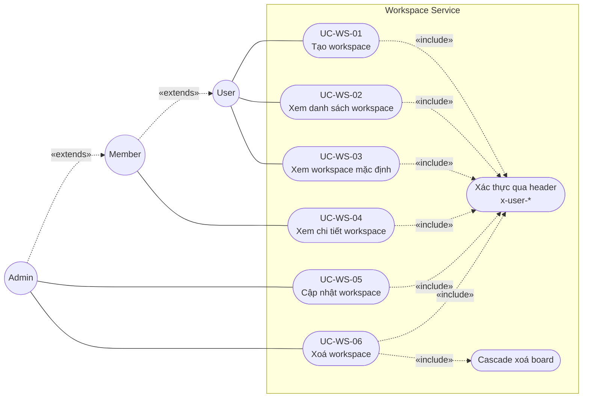

# Use Case Diagram — Workspace (UML 2.0)

> Biểu đồ ca sử dụng cho **phần Workspace** (UC-WS-01 → UC-WS-06), theo chuẩn ký hiệu **UML 2.0**.
> Các phần thành viên (UC-WS-07..11), quyền (UC-WS-12), role (UC-WS-13..14) **không** nằm trong phạm vi biểu đồ này.

## 1. Ký hiệu UML 2.0 sử dụng

| Ký hiệu | Mermaid xấp xỉ | Ý nghĩa |
|---|---|---|
| Actor (stick figure) | `((Tên))` hình tròn | Người/hệ thống bên ngoài tương tác |
| Use case (ellipse) | `(["Tên"])` hình bầu dục | Một chức năng hệ thống cung cấp |
| System boundary | `subgraph "Tên hệ thống"` | Phạm vi hệ thống |
| Association | `Actor --- UseCase` (đường liền) | Actor thực hiện use case |
| Generalization | `A -. "«extends»" .-> B` | Actor A kế thừa từ actor B |
| Include | `UC1 -. "«include»" .-> UC2` | UC1 bắt buộc dùng UC2 |
| Extend | `UC2 -. "«extend»" .-> UC1` | UC2 mở rộng UC1 (tuỳ chọn) |

## 2. Tác nhân (Actors)

| Actor | Vai trò |
|---|---|
| **User** | Người dùng đã đăng nhập (qua gateway, có `x-user-*` headers) |
| **Member** | User là thành viên active của một workspace |
| **Admin** | Member có `role = admin` trong workspace |

Quan hệ generalization: `Admin → Member → User`.

## 3. Biểu đồ

## 4. Bảng use case workspace

| Mã | Tên | Tác nhân | Endpoint |
|---|---|---|---|
| UC-WS-01 | Tạo workspace mới | User | `POST /api/workspaces` |
| UC-WS-02 | Xem danh sách workspace của tôi | User | `GET /api/workspaces` |
| UC-WS-03 | Xem workspace mặc định | User | `GET /api/workspaces/default` |
| UC-WS-04 | Xem chi tiết workspace | Member | `GET /api/workspaces/:id` |
| UC-WS-05 | Cập nhật workspace | Admin | `PATCH /api/workspaces/:id` |
| UC-WS-06 | Xoá workspace | Admin | `DELETE /api/workspaces/:id` |

## 5. Đặc tả chi tiết

Đặc tả từng use case (Precondition, Postcondition, Main flow, Alternative flow, Error code) đã được biên soạn riêng tại:

- `workspace-usecase-testplan.md` (root repo, mục Phần A — Đặc tả Use case).

Tham chiếu thêm:
- `docs/sequence-diagrams.md` — Sequence diagram của các luồng chính.
- `__tests__/TEST_RESULTS.md` — Kết quả kiểm thử các use case này.
